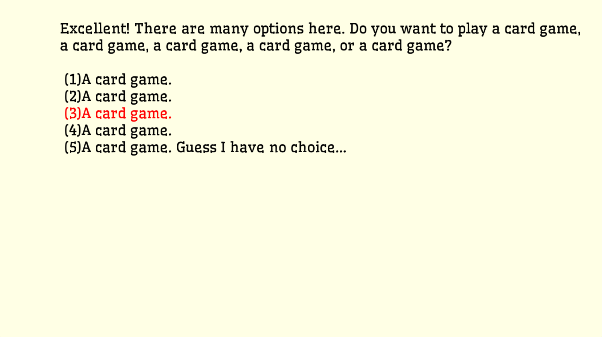

# It Takes Two Too

Author: Sherwin JIN

Design: A two player choice based gambling game, where each player can provide fake information to the other.

Text Drawing: The texts are rendered at runtime. The harfbuzz and freetype libraries are used for shading. The bitmap generated in shading process is used as texture by opengl for rendering.

Choices: The game stores the choices and narrative are mainly stored in txt files (in `dist/dialogs` directory). There is a `metadata.txt` file describes what files are they. Each file contains the following information in different lines: dialog ID; Number of choices of this dialog; The choices which contains the choice ID, next dialog ID if choose this choice, and choice text; The dialog main text. There are also some hardcoded choices and narratives in a class `CardGame`, as they are used for display dynamic game information. 

Screen Shot:

How To Play:

Press 1, 2, 3, 4, or 5 to activate a choice, and press space to confirm the choice. The game instructions will be provided in the game.

Sources: Font is downloaded at https://fonts.google.com/specimen/Wellfleet?query=wellfleet

This game was built with [NEST](NEST.md).

